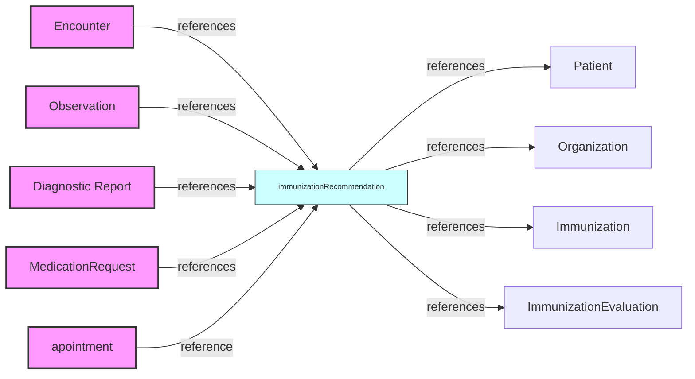

# Salut Flo

# One animal patient encounter

- All the fhir resource Instances are in the `records` folder

## To Be Added

1. Practitioner
2. Location
3. Organization

### Observation - Clinical Diagnostic

"description": "**Measurements** and simple **assertions** made about a patient, device or other subject"

### Condition (problem) - Clinical summary (won't be used)

"description": "A clinical condition, problem, _?diagnosis?_, or other event, situation, issue, or clinical concept that has risen to a level of concern.",

### Procedure - Clinical Summary

"description": "An action that is or was **performed** on or for a patient. This can be a physical intervention like an operation, or less invasive like long term services, counseling, or hypnotherapy.",

## Conceptually close, but not the same

> *The boundaries between clinical findings and disorders remains a challenge in medical ontology. Refer the Boundaries section below and in Condition for general guidance. These boundaries can be clarified by profiling Observation for a particular use case.

[*from fhir-Observation documentation](https://hl7.org/fhir/R4/observation.html)

------

## Resources FHIR (R4)

## [ImmunizationRecommendation](https://hl7.org/fhir/R4/immunizationrecommendation.html)

Ovet usage of ImmunizationRecommendation: 
1. patient DogFido received rabbies immunization today
2. Next shot recomended in 3 years
3. No apointment is taken
4. Therefore, the recommendation lives alonside the **patient**.
5. in 3 years, this information pushes a notif to the patient:
> "hey, take an apointement for DogFido 🐶 rabies"
6. and to everyone who might be concerned: Vet, Partner, VetClinic, ....

### Summary including all relations

_References_ 
- **Patient**
- Organization
- Immunization
- ImmunizationEvaluation

_Referenced by_:
- Appointment
- DiagnosticReport
- Encounter
- MedicationRequest
- Observation

